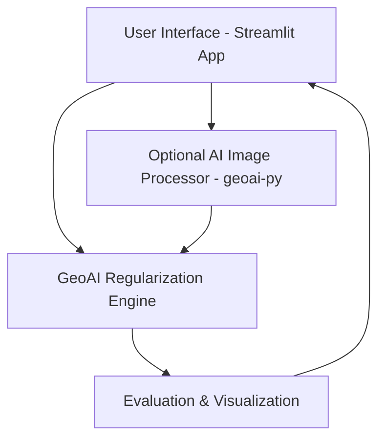

# 🏗️ Building Footprint Regularization using GeoAI

A GeoAI-powered project for cleaning, simplifying, and orthogonalizing building footprints extracted from vector and raster spatial datasets. This project combines classical computational geometry with modern deep learning (optional) to enhance building shape quality, improve urban data analytics, and support smart city initiatives.

---

## 📌 Table of Contents

* [Project Overview](#project-overview)
* [Features](#features)
* [Tech Stack](#tech-stack)
* [System Architecture](#system-architecture)
* [Installation](#installation)
* [Usage](#usage)
* [Demo](#demo)
* [Results](#results)
* [Regularization Techniques](#regularization-techniques)
* [Contributing](#contributing
---)
* [License](#license)


## 🚀 Project Overview

Building footprints obtained from sources like OpenStreetMap or satellite imagery often contain irregularities. These include:

* Non-orthogonal edges
* High vertex complexity
* Digitization noise

This project addresses the above by:

1. Regularizing vector shapes using orientation-aware geometry algorithms.
2. Optionally extracting buildings from satellite images using a pre-trained deep learning model.
3. Providing evaluation metrics and rich visualizations.

---

## ✨ Features

* 📂 Upload support for `.geojson`, `.shp`, `.zip`, and raster images.
* 🧠 AI module for extracting footprints using `geoai-py` (optional).
* 📏 Geometry simplification with Douglas-Peucker algorithm.
* 📐 Orthogonal snapping to 90/180 degrees using MRR.
* 📊 Visual comparison of original vs. regularized geometries.
* 📉 Metric computation: vertex reduction, area preservation, Hausdorff distance.
* 🌐 Interactive maps using Folium/Leafmap.
* 🔄 Download cleaned outputs.

---

## 🧰 Tech Stack

| Layer           | Technology                   |
| --------------- | ---------------------------- |
| UI              | Streamlit                    |
| Mapping         | Folium, Leafmap              |
| Geometry Engine | Shapely, GeoPandas           |
| ML Inference    | geoai-py, PyTorch (optional) |
| Visualization   | Matplotlib, Plotly           |
| Packaging       | Docker, Conda                |

---

## 🧱 System Architecture



> Optional deep learning module supports satellite image input.


>regularization


---

## 🔧 Installation

### Prerequisites

* Python >= 3.10
* Git
* Conda or pipenv (recommended)
* Docker (for reproducible setup)

### Steps

```bash
# Clone the repository
$ git clone https://github.com/yourusername/geoai-building-regularization.git
$ cd geoai-building-regularization

# Create environment
$ conda create -n geoai python=3.10
$ conda activate geoai
$ pip install -r requirements.txt

# Run the application
$ streamlit run geoai_regularization_app.py
```

---

## 🛠️ Usage

1. Launch the Streamlit app.
2. Upload a building footprint file (`.geojson`, `.shp`, `.zip`) or satellite image.
3. Adjust regularization parameters using the sidebar sliders.
4. Click **Run Regularization**.
5. View comparison charts and interactive maps.
6. Download regularized data and metrics.

> Tip: Enable the AI module to extract buildings from raw satellite imagery.

---

## 🎥 Demo

<p align="center">
  
</p>

---

## 📈 Results

| Metric             | Description                          |
| ------------------ | ------------------------------------ |
| Vertex Reduction   | Avg. \~35-60% simplification         |
| Area Preservation  | >95% in most cases                   |
| Hausdorff Distance | Mean < 0.5 (normalized scale)        |
| Processing Speed   | \~250 buildings/minute (vector mode) |

> Output quality validated against manual inspection and IoU comparisons.

---

## 🧮 Regularization Techniques

| Technique                | Applied? | Description                                    |
| ------------------------ | -------- | ---------------------------------------------- |
| Geometric Regularization | ✅        | Orientation, snapping, simplification          |
| Topological Correction   | ✅        | Ensures valid geometries with no overlaps      |
| Visual Cleanliness       | ✅        | Removes noise, improves rectilinearity         |
| ML-Based Extraction      | ✅        | AI model used to segment buildings from images |
| Semantic Enhancement     | ❌        | Not implemented – potential future direction   |

---

## 🤝 Contributing

We welcome contributions!

* Fork the repo
* Create a branch
* Submit a PR with clear description

See `CONTRIBUTING.md` for more details.

---

## 📄 License

This project is licensed under the MIT License. See [LICENSE](LICENSE) for more information.

---

> Created with ❤️ by Vibhor Joshi | Guided by Dr. Neeru Rathee @ MSIT Delhi

